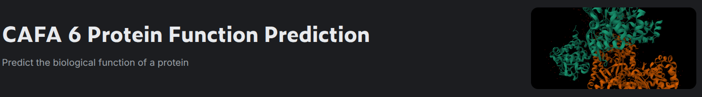

# kaggle-CAFA-6-Protein-Function-Prediction
kaggleのCAFA 6 Protein Function Predictionコンペの記録用

- directory tree
```
kaggle-CAFA-6-Protein-Function-Prediction
├── README.md
├── data        <--- gitで管理するデータ
├── nb          <--- jupyterで作成したノートブック
└── nb_download <--- ダウンロードしたノートブック 
```

## Overview
タンパク質は、細胞、組織、臓器、そして私たちの体内で多くの活動を担う大きな分子であり、細胞の構造と機能においても中心的な役割を果たしています。
タンパク質は、アミノ酸と呼ばれる20種類のアミノ酸から構成され、これらが長い鎖（タンパク質のアミノ酸配列）として配列されています。
各タンパク質は、その構造と機能を決定する固有の配列を持っています。あなたは、タンパク質のアミノ酸配列に基づいてその機能を予測するモデルを構築します。
これらの予測は、研究者がタンパク質の機能を理解する助けとなり、新たな医療治療法や療法の開発につながる可能性があります。

**Description**


## Log
**20260123**
- ひとまずGitHubのリポジトリ作成と日記での管理をスタート
- GitHubの使い方がむずい、、、とりあえずリモートとローカルを繋げられるようにはなった。
